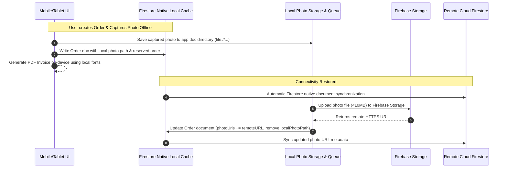

# HOUSE OF SIYA'S — TECHNICAL ARCHITECTURE & MASTER SYSTEM SPECIFICATION (MILESTONE 0)

> **Document Version**: 2.0.0 (Revised Milestone 0 Architecture)  
> **Status**: Milestone 0 — Requirements & Architecture Analysis (Re-evaluated & Corrected)  
> **Target Application**: House of SIYA's Business Management Suite  

---

## 🛑 REVISION LOG & ARCHITECTURAL CORRECTIONS

The following key architectural corrections have been made to align strictly with the Master Development Prompt requirements:

1. **Storage & Offline Engine Rationalization**: 
   - **Correction**: Removed redundant custom local database layers (`Isar`/`Hive`) for document data storage. **Cloud Firestore SDK native offline persistence** (IndexedDB on Web where applicable, native SQLite cache on Mobile) will serve as the single local storage and offline synchronization engine for all structured data. 
   - **Local Encrypted Storage**: `flutter_secure_storage` is retained exclusively for sensitive client credentials, user session tokens, local PIN hashes, and offline document range reservation pointers.
2. **GCP Backup & Retention Architecture Clarification**:
   - **Correction**: Aligned Firestore automated export with requirement #76: **Daily automated Firestore exports with 30-day daily retention + monthly exports kept for long-term disaster recovery** using GCP Cloud Storage Lifecycle rules.
3. **Serverless RBAC via Firebase Auth Custom Claims**:
   - **Correction**: Custom Claims (`role: 'owner' | 'manager'`) will be populated via a secure serverless initial setup function or user-management Cloud Function trigger, allowing Firestore Security Rules to enforce zero-trust RBAC at the database edge without requiring an always-on backend server.
4. **Offline Document Sequence Consumption & Exhaustion**:
   - **Correction**: 
     - **Timing**: Sequences are allocated **only upon user confirmation/generation of the entity or document**, NOT upon opening a form.
     - **Exhaustion Handling**: If an offline device consumes its pre-reserved 50-number block while remaining offline, the app switches to an **Offline Pending ID state** (`PENDING-REC-xxxx` or device-local queue sequence) for draft/local records. The formal document sequence number is assigned immediately upon reconnecting to the network, preventing operation blocking while guaranteeing auditability.
5. **Scope of Payments & Refunds**:
   - **Correction**: Explicitly clarified that payments and refunds are supported for both **Orders** and **Classes (Student Fees)**.
6. **Photo Offline Synchronization Flow**:
   - **Correction**: Captured photos are saved locally to platform application storage (`getApplicationDocumentsDirectory`). Offline records hold local `file://` paths for immediate UI rendering. A background `PhotoSyncService` uploads files to Firebase Storage when online, updates Firestore document metadata with remote HTTPS URLs, and cleans up local caches.
7. **Platform Offline Capability Matrix (Mobile vs. Web)**:
   - **Correction**: Explicitly demarcated platform capabilities. **Mobile/Tablet** is fully offline-capable (local Firestore cache, local media storage, local PDF engine). **Web app strictly requires an internet connection** (Requirement #6 & #56) and does not support offline mutation queuing.

---

## 1. Executive Summary & Core Principles

**House of SIYA's** is a specialized, high-performance, offline-first mobile/tablet app and responsive web application designed for a premium bridal, tailoring, embroidery, saree draping, and dress rental studio.

### Key Architectural Pillars
1. **Low Recurring Cost**: Zero always-on compute server instances. 100% serverless using Firebase Free Tier (Spark) and low-scale Blaze quotas.
2. **Native Firestore Offline Engine**: Mobile/Tablet app operates offline using Cloud Firestore native offline persistence, client-side PDF rendering, offline document range reservation, and background media synchronization.
3. **Strict RBAC & Auditability**: Enforced via Firebase Auth Custom Claims (`role: 'owner' | 'manager'`) and Firestore Security Rules. Immutable, system-only audit logging.
4. **Resilient Offline Document Range Allocation**: Zero-collision sequence allocations through client-reserved ranges (50 per block) with graceful pending sequence fallbacks during extended offline operation.

---

## 2. Technology Stack & Framework Selection

| Layer | Component / Package | Technical Rationale |
| :--- | :--- | :--- |
| **Frontend Platform** | **Flutter 3.x / Dart 3.x** | Single codebase targeting Android (primary release target), iOS/iPad, and Web responsive dashboard. |
| **State Management** | **Flutter Riverpod (`flutter_riverpod` + `riverpod_annotation`)** | Reactive, compile-time safe, clear separation of UI from business logic, highly testable. |
| **Authentication** | **Firebase Auth + Custom Claims** | Mobile number + OTP identity authentication. Manager/Owner roles embedded in Firebase JWT custom claims. |
| **Local App Lock & Secrets** | **`flutter_secure_storage` & `local_auth`** | Encrypted key-value storage for local PIN hash, device registration, and biometric app unlock wrapper. |
| **Database & Offline Engine** | **Cloud Firestore (Native Persistence)** | Unified single data engine for online & offline CRUD on Mobile/Tablet. Eliminates dual-database synchronization issues. |
| **Cloud File Storage** | **Firebase Storage** | Object storage for customer, order, measurement, and rental photos/attachments (Max 10MB per file). |
| **Document / PDF Engine** | **`pdf` + `printing` packages** | 100% client-side PDF rendering on device, offline printing, and native share sheet triggering. |
| **Analytics & Diagnostics**| **Firebase Analytics & Crashlytics** | Lightweight performance monitoring and error reporting. |

---

## 3. High-Level System Architecture

```mermaid
graph TD
    subgraph Mobile / Tablet App (Offline-Capable)
        UI[Flutter Presentation Layer]
        RP[Riverpod State / Controllers]
        FSD[(Firestore Native Local Cache)]
        PDF[Client-Side PDF Generator]
        NR[Offline Range Allocator]
        SS[Photo Sync Queue - Local Files]
        
        UI --> RP
        RP <--> FSD
        RP --> PDF
        PDF --> NR
        RP --> SS
    end
    
    subgraph Web App (Online Only)
        WUI[Responsive Web UI]
        WRP[Riverpod Controllers]
        WUI --> WRP
    end

    subgraph Firebase / GCP Cloud Architecture
        FA[Firebase Auth + Custom Claims]
        FS[(Cloud Firestore Master DB)]
        ST[(Firebase Storage Buckets)]
        SR[Firestore & Storage Security Rules]
        BK[GCP Daily & Monthly Backups]
        
        FS <--> BK
        SR --> FS
        SR --> ST
    end

    FSD <== Native Firestore Sync ==> FS
    WRP <== Direct Firestore Stream (Online) ==> FS
    SS <== Background Photo Upload ==> ST
    UI <== Phone OTP / Claims ==> FA
    WUI <== Phone OTP / Claims ==> FA
```

---

## 4. Firestore Data Model & Collection Schema

All business records reside under a single root business model structure: `businesses/{businessId}/...` (V1 targets `house_of_siyas`).

```
businesses/
  └── house_of_siyas/
        ├── appSettings/default
        ├── numberingAllocations/{deviceId}
        ├── users/{userId}
        ├── devices/{deviceId}
        ├── customers/{customerId}
        │     └── notesHistory/{noteId}
        ├── measurementTemplates/{templateId}
        ├── measurementSets/{measurementId}
        ├── services/{serviceId}
        ├── orders/{orderId}
        │     └── orderActivities/{activityId}
        ├── orderItems/{itemId}
        ├── payments/{paymentId}
        ├── refunds/{refundId}
        ├── customerCredits/{creditId}
        ├── documents/{documentId}
        ├── rentalItems/{rentalItemId}
        ├── rentals/{rentalId}
        ├── alterations/{alterationId}
        ├── students/{studentId}
        │     └── classPayments/{classPaymentId}
        └── auditLogs/{auditId}
```

### Core Schema Models

#### 1. `customers`
```typescript
interface Customer {
  id: string; // Document ID
  customerId: string; // e.g. "CUS-0001"
  name: string;
  mobile: string | null;
  whatsappMobile: string | null;
  whatsappSameAsMobile: boolean;
  address: string | null;
  generalNote: string | null;
  photoUrl: string | null;
  status: 'active' | 'archived';
  createdAt: Timestamp;
  updatedAt: Timestamp;
  createdBy: string;
  updatedBy: string;
}
```

#### 2. `orders` & `orderItems`
```typescript
interface Order {
  id: string;
  orderNumber: string; // e.g. "HS-ORD-0001"
  customerId: string;
  measurementSetId: string | null;
  subtotal: number;
  discount: number;
  totalAmount: number;
  paidAmount: number;
  balanceAmount: number;
  creditAmount: number;
  status: 'enquiry' | 'confirmed' | 'in_progress' | 'ready_for_trial' | 'alteration' | 'ready' | 'delivered' | 'closed' | 'cancelled';
  deliveryDate: Timestamp;
  photoUrls: string[]; // Remote Firebase Storage URLs
  localPhotoPaths?: string[]; // Temporary local device paths when pending sync
  attachmentPaths: string[];
  generalNote: string | null;
  createdAt: Timestamp;
  updatedAt: Timestamp;
  createdBy: string;
  updatedBy: string;
  isArchived: boolean;
}
```

#### 3. `payments` & `refunds` (Orders & Classes)
```typescript
interface Payment {
  id: string; // Client-generated UUID
  entityType: 'order' | 'class';
  entityId: string; // orderId or studentId
  customerId?: string; // Set if entityType == 'order'
  studentId?: string; // Set if entityType == 'class'
  amount: number;
  method: 'cash' | 'upi';
  receiptNumber: string | null; // e.g. "HS-REC-0001" or "HS-CLS-0001"
  paymentDate: Timestamp;
  recordedBy: string;
  notes: string | null;
  createdAt: Timestamp;
}

interface Refund {
  id: string;
  entityType: 'order' | 'class';
  entityId: string;
  originalPaymentId?: string;
  amount: number;
  method: 'cash' | 'upi';
  reason: string;
  recordedBy: string;
  refundDate: Timestamp;
  createdAt: Timestamp;
}
```

#### 4. `numberingAllocations` (Offline Sequence Reservation)
```typescript
interface DeviceNumberAllocation {
  deviceId: string;
  documentType: 'order' | 'invoice' | 'payment' | 'rental' | 'class' | 'alteration' | 'customer';
  rangeStart: number; // e.g. 51
  rangeEnd: number;   // e.g. 100
  currentAllocated: number; // e.g. 58
  reservedAt: Timestamp;
}
```

---

## 5. Offline Data Synchronization & Photo Pipeline



---

## 6. Offline Document Numbering Strategy & Exhaustion Protocol

To prevent number collisions while maintaining offline capability:
1. **Reserved Block Allocation**: When online, a device reserves a block of **50 sequence numbers** per entity sequence via Firestore transactions (e.g., `HS-INV-0051` to `HS-INV-0100`).
2. **Consumption Timing**: Sequence numbers are consumed **strictly when the record/document is confirmed and saved by the user**, never during draft/form opening.
3. **Block Exhaustion Fallback**: If a device consumes all 50 reserved numbers while remaining offline:
   - The app generates a temporary local identifier: `PENDING-{PREFIX}-{UUID}` (e.g., `PENDING-REC-a1b2c3d4`).
   - The document and PDF receipt display the pending status.
   - Upon reconnecting to the network, the sync engine automatically top-ups the device range and assigns the next formal sequence number.
4. **Audit Rule**: Unused reserved numbers from a block are **never reused or re-allocated**, preserving sequence integrity and audit safety.

---

## 7. Role-Based Access Control (RBAC) & Security Enforcement

Security is enforced via **Firebase Authentication Custom Claims** (`request.auth.token.role`).

| Feature / Action | Owner / Admin | Manager | Firestore Security Rule Condition |
| :--- | :---: | :---: | :--- |
| **View / Create Customers & Orders** | ✅ | ✅ | `request.auth != null` |
| **Capture / View Measurements** | ✅ | ✅ | `request.auth != null` |
| **Record Payments (See Current Balance)** | ✅ | ✅ | `request.auth != null` |
| **Manage Rentals & Alterations** | ✅ | ✅ | `request.auth != null` |
| **Generate Documents (Invoices, Receipts)** | ✅ | ❌ | `request.auth.token.role == 'owner'` |
| **Access Financial Reports / Dashboard** | ✅ | ❌ | `request.auth.token.role == 'owner'` |
| **Access Classes & Student Fees** | ✅ | ❌ | `request.auth.token.role == 'owner'` |
| **Archive / Restore Any Record** | ✅ | ❌ | `request.auth.token.role == 'owner'` |
| **Modify Settings / Templates / Users** | ✅ | ❌ | `request.auth.token.role == 'owner'` |
| **Export Data / Restore Backup** | ✅ | ❌ | `request.auth.token.role == 'owner'` |
| **Modify Audit Logs** | ❌ (System Only)| ❌ | `allow write: if false;` |

---

## 8. Backup & Data Retention Strategy

1. **Automated Firestore Backups**: Configured via GCP Cloud Scheduler / Firestore Export API to export database collections daily to a dedicated Cloud Storage bucket (`house-of-siyas-backups`).
2. **Retention Lifecycle Policy**:
   - **Daily Backups**: Retained for **30 days**.
   - **Monthly Backups**: Retained long-term for disaster recovery.
3. **Manual Export**: Owner can trigger unstructured/structured Excel/CSV exports of active and archived records anytime.

---

## 9. Platform Capability Matrix (Mobile vs. Web)

| Capability | Mobile / Tablet (Android / iOS) | Responsive Web App |
| :--- | :---: | :---: |
| **Target Audience** | Owner & Managers (Store Operations) | Owner & Managers (Admin & Desk Work) |
| **Offline Operation** | ✅ Full Offline CRUD & Local PDF | ❌ **Online Only** (Requires Internet) |
| **Camera & Measurement UX** | Optimized for fast mobile camera capture | Standard photo upload / view |
| **Document Generation** | Local On-Device PDF rendering | Local On-Device PDF rendering |
| **Data Sync Engine** | Native Firestore SQLite cache | Online Firestore live listeners |

---

## 10. Cost Optimization Matrix (Target: ₹0–Minimal Monthly Spend)

| GCP / Firebase Resource | Free Tier Quota | Strategy for House of SIYA's | Projected Cost |
| :--- | :--- | :--- | :--- |
| **Firebase Auth** | 10k SMS/Month | ~100-500 auths/month | **₹0 / Month** |
| **Cloud Firestore** | 50k reads, 20k writes/day | Native caching & indexed queries | **₹0 / Month** |
| **Firebase Storage** | 5 GB storage | Client-side JPEG compression (Max 10MB, target ~300KB) | **₹0 / Month** |
| **Cloud Run** | 2M requests/month | **Not used for PDF generation** (100% on-device PDF) | **₹0 / Month** |

---

## 11. Updated Milestone Implementation Plan

* **Milestone 0: Requirements & Architecture Analysis (REVISED)** *(Current)*
* **Milestone 1: Firebase & GCP Foundation Setup**
* **Milestone 2: Data Model, Security Rules & Custom Claims RBAC Engine**
* **Milestone 3: Flutter Application Foundation & Theme System**
* **Milestone 4: Customer Management Module**
* **Milestone 5: Measurement Engine & Configurable Templates**
* **Milestone 6: Order Management, Services Catalogue & Line Items**
* **Milestone 7: Payments, Overpayments, Refunds & Ledger Engine (Orders & Classes)**
* **Milestone 8: Client-Side PDF Generation & Reserved Numbering System**
* **Milestone 9: Rental Catalogue & Reservation Overlap Prevention**
* **Milestone 10: Alterations Module**
* **Milestone 11: Classes & Student Fee Tracking (Owner Only)**
* **Milestone 12: Offline Synchronization & Photo Upload Engine**
* **Milestone 13: Local Notifications & Prefilled WhatsApp Integration**
* **Milestone 14: Owner Dashboard, Financial Reports & XLSX/CSV Export**
* **Milestone 15: Settings, Dynamic Branding & Numbering Configuration**
* **Milestone 16: System Audit Trail, Security Hardening & Backup Strategy**
* **Milestone 17: Comprehensive Testing (Unit, UI, Offline, RBAC, Financials)**
* **Milestone 18: Production Build & Release Preparation**

---

## Milestone 0 (Revised) Completion Summary

### Completed
1. **Rationalized Storage Architecture**: Removed redundant `Hive`/`Isar` local database layers; adopted Cloud Firestore native offline persistence as the single offline data engine.
2. **Refined Backup Schedule**: Defined daily export with 30-day lifecycle + long-term monthly retention.
3. **Decoupled Serverless RBAC**: Standardized on Firebase Auth Custom Claims (`role: 'owner' | 'manager'`) for zero-trust Firestore Security Rules without an always-on backend.
4. **Enhanced Document Number Allocation**: Specified consumption timing (on save) and offline range exhaustion fallback (`PENDING-` status).
5. **Expanded Payment/Refund Scope**: Explicitly included both Orders and Classes in the payment/refund ledger architecture.
6. **Clarified Photo Upload Queue**: Specified local file rendering with background Firestore metadata patch upon upload.
7. **Demarcated Mobile vs. Web Capabilities**: Mobile/Tablet is offline-first; Web requires active internet connectivity.

### Files Updated
* [`architecture_proposal.md`](file:///C:/Users/veera/.gemini/antigravity/brain/fa7b2f86-2e37-47b6-8548-5f952883267e/architecture_proposal.md)
* [`implementation_plan.md`](file:///C:/Users/veera/.gemini/antigravity/brain/fa7b2f86-2e37-47b6-8548-5f952883267e/implementation_plan.md)

### Next Step
Await user approval for revised Milestone 0 architecture before proceeding to **Milestone 1: Firebase & GCP Foundation Setup**.
